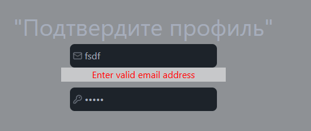
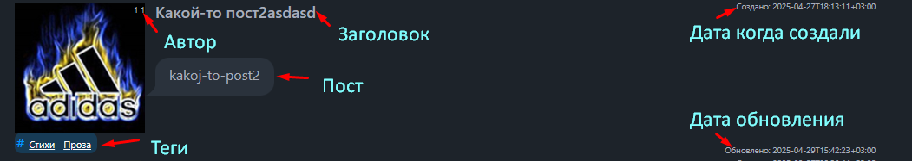
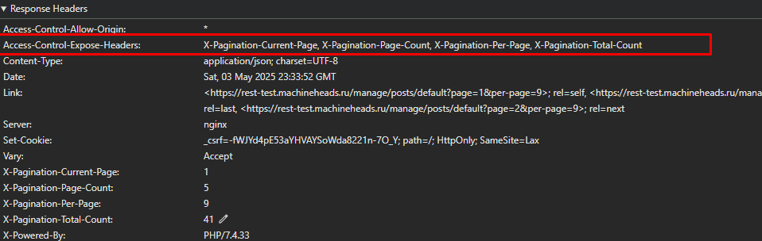

[Просмотр UI](https://tryd0g0lik.github.io/admin_ui/) страницы

### Команды
```js
// package.json
"lint": "eslint src --ext jsx,ts,tsx", // чистим код
"cssstyle": "npx @tailwindcss/cli -i ./src/styles/style.css -o ./src/output.css --watch", // Для работы с FW 'tailwind' и 'daisyui' 
"build": "webpack --mode=production --config webpack.config.js", // сборка pordaction
"server": "webpack server --mode=development  --config webpack.config.dist.js" // Сервер для разработки.
/**
 * HUSKY
 * https://typicode.github.io/husky/
 * Авто-проверка чистоты кода. ".husky/pre-commit" настроен - авто-запуск (команда "lint") проверки кода при совершении "git commit".
*/

```

## 1. Пользователь 
**Note**: *В силу ограниченных действий и событий, образ пользователя собирается через* \
*"`Object`/`JSON`". ООП не используется.*


Любой пользователь попадая на страницу арр получает статус "`ANONYMOUSUSER`" и привелегии действий "`NoN`".\
```ts
import { UserPrivaleges, UserStatus, User } from "src/interfesaces";
{ // базовый user state.
  "email": "",
  "password": "",
  "status": UserStatus.STATUS_ANONYMOUSUSER,
  "privaleges": [UserPrivaleges.PRIVALEGES_ANONYMOUS],
  "token": ""
}
```
В данный момент, логика приложения основывается на таких свойствах как:\
- "`email`";
- "`password`";
- "`status`";
- "`privaleges`".

**Note**: *"`password`", "`email`" для передачи данных при событии авторизации*.\
*Затем - стираем данные*.

"`status`" и "`privaleges`" регулируют уровень доступа и отобращаемого контента на странице.

**Например**, *если статут не является "`ANONYMOUSUSER`" , то открывается дополнительный раздел в верхнем меню, с его подразделами*.

**Подробнее** *о статусах и привелегиях пользователя "`src\interfesaces.ts`".*

Данные храним в "`localStorage`" ("`LS`").  Из LS востатанавливаем REDUX, а после и привелегии, доступы на страницах. 


### 1.2 CACH
1. Состояние образа пользователя сохраняется в "`localStorage`" с ключем "`user`".\
Данный  cach - востанавливает REDUX при событиях - перезагрузка и прочие перезагрузки страниц. \
"`src\reduxes\features\userstate\userSlice.ts`"

2. Токены (можно сохранить и в рабочей среде) сохраняем в "`Cookie`".

На этапе загрузки страницы , проверяем "`cookie`" и "`LS`". \
Redux: "`src\reduxes\features\userstate\userSlice.ts`"\
В приоритете проверки "`cookie`" и если токен не находим, удаляем "`LS`". Пользователь вновь получает \
статус "`ANONYMOUSUSER`", дополнительно чистим REDUX.

Для работы с "`cookie`" "`src\services\cookies`" созданы:
- чистим cookie;
- проверка жизни cookie;
- обновление cookie;
- получене данных из cookie.

### 1.2.1 CAСHE POSTS
Для примера.\
На странице \
"`src\components\Posts\handlers\handlerRequest.ts`"\
можно использовать "`useMemo`" от React - Все посты хранить в кеше и не делать лишние запросы на сервер.\
Например, отслеживать "`url-пагинацию`" и "`токен`".\
```ts
const memoizedPosts = useMemo(() => {
  return requestJWTGet(url, Object.values(getToken)[0]);
}, [url, getToken]);
```
Первичный запрос постов - создаем кеш. В последющих данные берем из кеша, пока не заметим изменения в переменных "`url, getToken`".

Кеш не сделал, момент в том - как отследить редактирование поста, причем ДО запроса не сервер. 

## 2. UI
Клик по кнопке "`Вход`" открывает модальное окно с формой.\
"`src\components\InSideForm\index.tsx`"

0. Пд капотом написан сервис с которым,  пользователь  остаётся авторизованным в любое время\
пока действует токен. Пользователю не требуется проводить посторную авторизацию, при:
- открытии новой вкладки;
- перезагрузки страницы;
- закрытии браузера. Его состояние - в авторизации - остаётся действующим.

1. Форма имеет свои регулярные выражения, в качестве шаблона для проверки валидности контента полей.\
Заполняем поля, событие с клавишей "`Enter`" из поля ("`<input>`') вызывает проверку и публикует/удаляет ообщения об ошибке.

Всплываюшее описание  \


Если корректно заполнено, отправляем запрос на сервер.\
"`src\components\NavBar\hamdlers`".

2. Текст кнопки "`Вход`":
- изменение статуса "`ANONYMOUSUSER`" на любой другой, текст меняет на "`Выход`".

3. Наличие, на кнопке теста "`Выход`" не позволяет повторно вызывать форму активации. 
4. Клик по кнопке с текстом "`Выход`" чистит "`cookie`" и "`localStorage`".\
5. Клик по кнопке с текстом "`Выход`" перекидывает пользователя на главную.\
Пользователь вновь получает статус "`ANONYMOUSUSER`". 

### 2.1 "Посты" Получить список постов
**Note:** 
- *Возможно логика (которая закладывалась при создании задачи) не совпадает с текущей реализацией, или что-то вовсе не реализовано - не несёт в себе вывод - "не могу сделать"*.\
 *Причина - отсутствие возможности  задать вопрос в текущем режиме (в том числе несёт и перерасход времени выполнения задачи)*. 

Список постов возможно получить если:
- статус пользователя не является "`ANONYMOUSUSER`";
- "`access_token`" токен рабочий;
- если "`access_token`" не действующий, пользователь имеет три попытки - обновить "`access_token`" используя "`refresh_token`". 
  - Пользователю, не требуется совершать проверки и отправки запросов на сервер (все под капотом).\
  - Если ТРИ запроса не удачные, пользователь остается авторизованным, но в консоль получаем ошибки. \
"`src\components\Posts\handlers\handlerRequest.ts`"

### 2.2 # Теги (под постом - фильтр контента)


- Первичный клик по одному из тегов, совершает фильтрацию постов. Результат события - публикация отфильтрованных постов (после клика по тегу) - владеющие одноименным тегом.
- Последующие клики (по тегам), будут фильтровать уже раннее отфильтрованный контент.


- Клик по тегу переименовывает кнопку. Из "`Загрузить`" в "`Сбросить`".
- Клик по кнопке "`Сбросить`" - возвращает (на страницу) первоначальный контент. 
  - Кнопка "`Сбросить`" не проводить запросы на сервер. Первоначальный контент храниться у пользователя ("`new Map()`"). 
- "`new Map()`" обнуляется после клика по "`Сбросить`".

**Note:** *Первичная загруз контента проводится по событию клика, по кнопке "`Загрузить`".*\
*Первичный контент возможно было бы подать по событию загрузки страницы. Но в рамках данной задачи, решил применить "`Загрузить`"*.

"`src\components\Posts\index.tsx`".

### 2.2 Пагинация
Совершая запрос на сервер ("`pathname=/manage/posts`"), получаю ответ (браузер)"\


Но запрос "`response.headers.get(...);`" возвращает "`null`".\
Как вариант, браузер не даст доступ к ключу "`Link`". Ключ указан в "`Access-Control-Expose-Headers`".\

Просьба добаить "`Link`" в "`Access-Control-Expose-Headers`"

```http
Access-Control-Expose-Headers: X-Pagination-Current-Page, X-Pagination-Page-Count, X-Pagination-Per-Page, X-Pagination-Total-Count, Link
```
